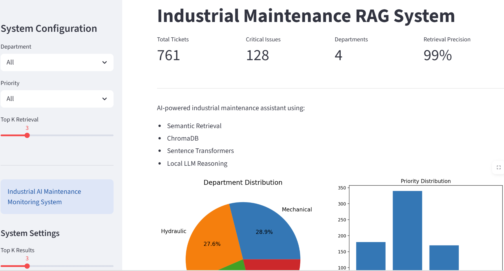
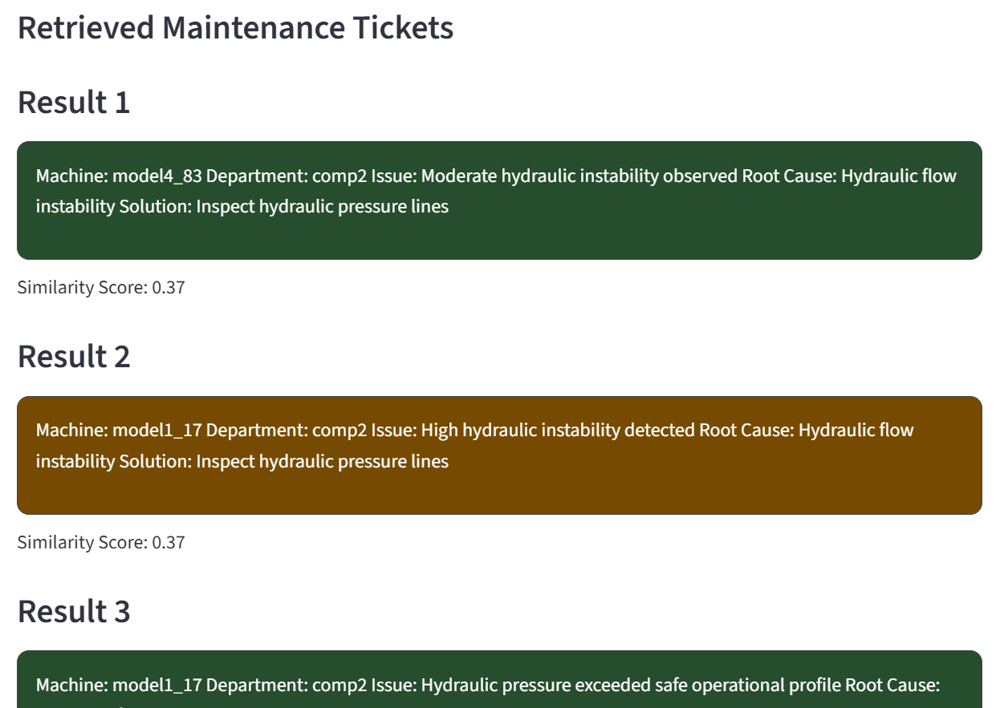
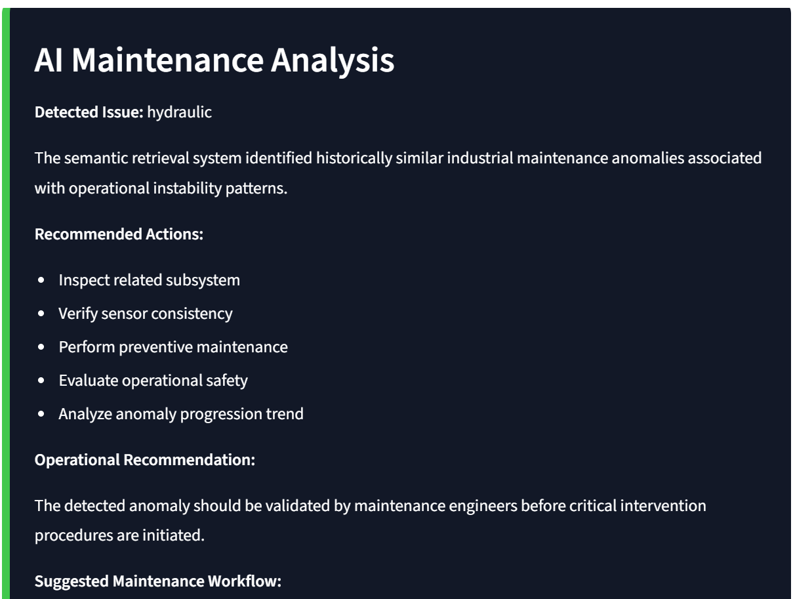
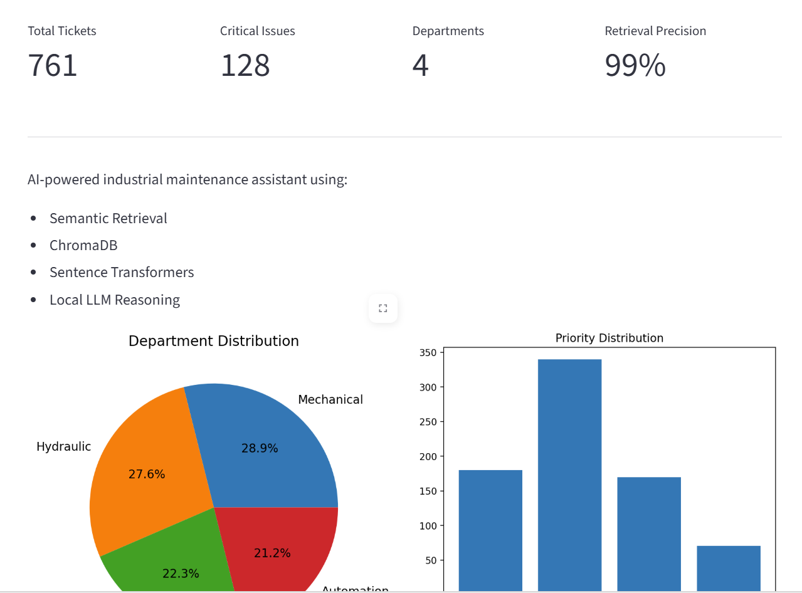

# Industrial Maintenance RAG System

## AI-Powered Semantic Maintenance Retrieval Platform

---

## Overview

Industrial Maintenance RAG System is an AI-powered semantic retrieval and maintenance analysis platform designed for predictive maintenance and industrial troubleshooting scenarios.

The project combines:

* Retrieval-Augmented Generation (RAG)
* Semantic search
* Vector databases
* Industrial maintenance ticket generation
* Sentence Transformer embeddings
* Local LLM reasoning
* Interactive Streamlit dashboard
* Robust retrieval evaluation

The system retrieves historically similar maintenance tickets and provides AI-assisted industrial maintenance analysis.

---

## Key Features

### Semantic Maintenance Retrieval

* AI-powered semantic ticket search
* Embedding-based similarity matching
* Context-aware industrial retrieval
* ChromaDB vector database integration

### Industrial RAG Pipeline

* Retrieval-Augmented Generation architecture
* Historical maintenance grounding
* Local AI reasoning support
* Maintenance anomaly interpretation

### Interactive Dashboard

* Streamlit-based industrial UI
* KPI monitoring cards
* Interactive maintenance analytics
* Priority-based visualization
* Similarity scoring

### Retrieval Evaluation

* LOGO-style evaluation
* Leave-One-Model-Out robustness testing
* Semantic retrieval benchmarking
* Industrial retrieval metrics

---

## System Architecture

```text
┌───────────────────────────────┐
│        User Query             │
└──────────────┬────────────────┘
               │
               ▼
┌───────────────────────────────┐
│ Sentence Transformer Embedding│
└──────────────┬────────────────┘
               │
               ▼
┌───────────────────────────────┐
│     ChromaDB Retrieval        │
└──────────────┬────────────────┘
               │
               ▼
┌───────────────────────────────┐
│ Top-K Similar Maintenance Docs│
└──────────────┬────────────────┘
               │
               ▼
┌───────────────────────────────┐
│    AI Maintenance Analysis    │
└──────────────┬────────────────┘
               │
               ▼
┌───────────────────────────────┐
│  Streamlit Interactive UI     │
└───────────────────────────────┘
```

---

## Pipeline Flowchart

```text
Maintenance Tickets
        │
        ▼
Text Cleaning & Formatting
        │
        ▼
Sentence Embedding Model
        │
        ▼
Vector Database Storage
        │
        ▼
Semantic Retrieval
        │
        ▼
Top-K Relevant Tickets
        │
        ▼
Industrial AI Reasoning
        │
        ▼
Maintenance Recommendation
```

---

## Dashboard Screenshots

### Main Dashboard



### Retrieval Results



### AI Maintenance Analysis



### KPI Monitoring



---

## Technologies Used

### AI / Machine Learning

* Sentence Transformers
* BGE Embedding Models
* Semantic Similarity Retrieval
* Retrieval-Augmented Generation (RAG)

### Vector Database

* ChromaDB

### UI

* Streamlit
* Matplotlib

### Data Processing

* NumPy
* Pandas

### Industrial AI Concepts

* Predictive Maintenance
* Maintenance Ticket Analysis
* Semantic Industrial Retrieval
* Anomaly Reasoning
* Maintenance Risk Assessment

---

## Dataset

The project uses:

* AI-generated industrial maintenance tickets
* Predictive maintenance machine information
* Industrial anomaly descriptions
* Root-cause information
* Operational priority levels
* Dominant anomaly signal categories

Example departments:

* Mechanical
* Hydraulic
* Thermal
* Automation

Example dominant signals:

* vibration
* pressure
* rotation

---

## Evaluation Strategy

A LOGO-style evaluation strategy is applied:

### Leave-One-Model-Out (LOMO)

For each machine model:

* Tickets belonging to that model are used as unseen test queries
* Semantic retrieval is performed using the vector database
* Retrieved tickets are evaluated for industrial relevance

This evaluates:

* Semantic generalization capability
* Industrial robustness
* Retrieval consistency
* Cross-model maintenance reasoning

---

## Evaluation Metrics

### Department Precision@K

Measures whether retrieved tickets belong to the same industrial department.

### Priority Precision@K

Measures similarity of maintenance urgency levels.

### Root Cause Precision@K

Measures semantic consistency of industrial failure causes.

### Dominant Signal Precision@K

Measures whether retrieved tickets contain similar anomaly signal patterns.

### Average Semantic Similarity

Embedding-level semantic similarity measurement.

### Unique Retrieval Ratio

Measures duplicate retrieval robustness and retrieval diversity.

---

## Example Retrieval Evaluation Results

```text
============================================================
LOGO-STYLE RETRIEVAL EVALUATION RESULTS
============================================================
Department Precision@3: 1.00
Priority Precision@3: 0.39
Root Cause Precision@3: 1.00
Dominant Signal Precision@3: 0.64
Average Semantic Similarity: 0.62
Unique Retrieval Ratio: 0.99
Total Queries Evaluated: 761
============================================================
```

---

## Streamlit Dashboard Features

### KPI Monitoring

* Total Tickets
* Critical Issues
* Retrieval Precision
* Department Statistics

### Visualization

* Department distribution charts
* Priority distribution charts
* Risk-colored maintenance cards
* Similarity score visualization

### AI Analysis

* Maintenance reasoning
* Preventive maintenance suggestions
* Operational recommendations
* Risk-oriented maintenance workflow

---

## Installation

### Clone Repository

```bash
git clone <repository_link>
cd Agents-Maintenance-AI
```

### Create Environment

```bash
conda create -n maintenance_ai_env python=3.11
conda activate maintenance_ai_env
```

### Install Requirements

```bash
pip install -r requirements.txt
```

---

## Run Vector Database Creation

```bash
python create_vector_db.py
```

---

## Run Retrieval Evaluation

```bash
python advanced_retrieval_eval.py
```

---

## Run Streamlit Dashboard

```bash
streamlit run streamlit_app.py
```

---

## Example Query

```text
critical hydraulic instability
```

---

## Example Retrieval Output

```text
Machine: model2_11
Department: Hydraulic
Issue: Hydraulic pressure instability detected
Root Cause: Hydraulic valve degradation
Solution: Inspect hydraulic valves and pressure lines
```

---

## Project Structure

```text
Agents-Maintenance-AI/
│
├── app/
│   ├── streamlit_app.py
│   ├── rag_pipeline.py
│   ├── advanced_retrieval_eval.py
│   ├── create_vector_db.py
│   └── advanced_generate_tickets.py
│
├── data/
│   ├── maintenance_tickets.csv
│   └── PdM_machines.csv
│
├── chroma_db/
│
├── requirements.txt
│
└── README.md
```

---

## Future Improvements

* Real-time anomaly monitoring
* Live industrial sensor streaming
* Multi-agent maintenance AI
* Predictive failure forecasting
* PDF maintenance reports
* SQL backend integration
* Docker deployment
* Cloud deployment
* Industrial IoT integration

---

## Author

Mustafa Demetgül

Research Associate – Karlsruhe Institute of Technology (KIT)

Industrial AI | Predictive Maintenance | Semantic Retrieval | RAG Systems | Industrial Machine Learning

---

## License

This project is intended for academic research and industrial AI demonstration purposes.
